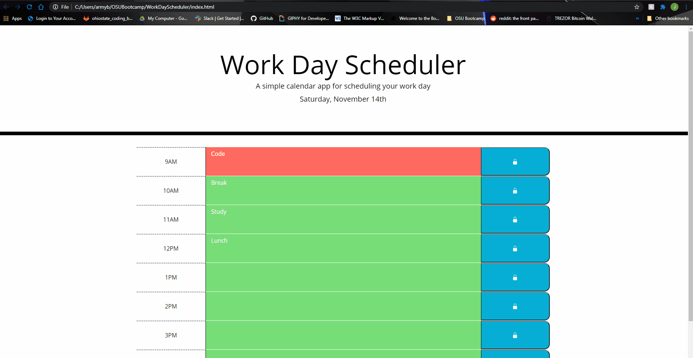

# WorkDayScheduler
## A simple calendar application that allows a user to save events for each hour of the day by modifying starter code. This app will run in the browser and feature dynamically updated HTML and CSS powered by jQuery.

# Technologies Used:
 * HTML
 * CSS

#List of JS methods and listeners

* colorUpdate()
  * updates the color of the textarea element depending on the time

* pullActivities()
  * gets text saved in textareas if available in local storage

* (".saveBtn").click
  *  save button listener, will save text in textarea if button clicked

## Visual:

[Gitpages Link](https://jordanks93.github.io/WorkDayScheduler/)

## Author: 
Jordan Stuckman - jordanks93@gmail.com

## License:
[MIT](./license/license.txt)

